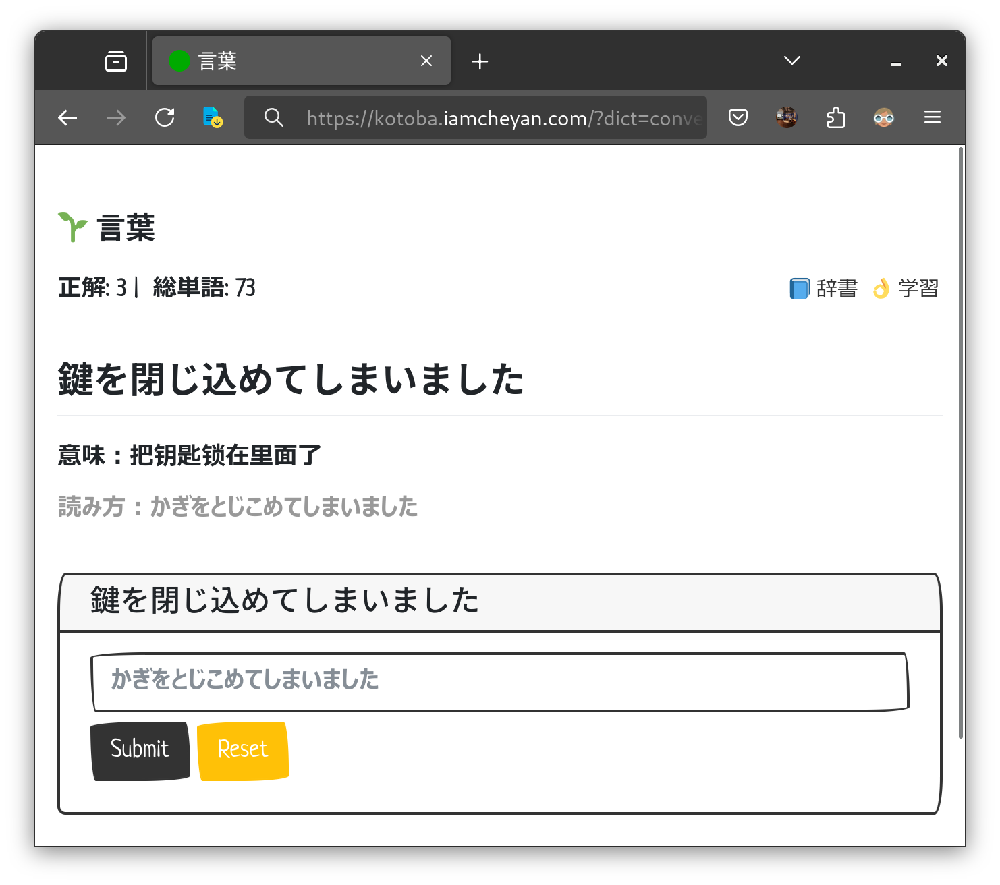

# 言葉

ウェブベースの日本語学習ツールです。インタラクティブなインターフェースで日本語の語彙を練習しながら、読み方・ローマ字・振り仮名などの表示を柔軟に切り替えられます。

## 🚀 技术架构与特色

### 核心技术栈
- **HTML/CSS/JavaScript** - 纯前端渲染界面，支持响应式布局
- **Kuroshiro + Kuromoji** - 在浏览器端完成汉字到假名、罗马音的实时转换
- **Wanakana** - 统一用户输入格式，支持假名与罗马音互转
- **Darkmode.js** - 一键切换暗黑模式，自动跟随系统主题

### 技术亮点
- **纯前端智能假名转换** - 借助 Kuroshiro 在浏览器内生成读音与罗马音，支持振り仮名渲染
- **多词典系统** - JSON 配置驱动，可在界面中即时切换 N5-N1、语法、会话、片假名等词库
- **离线友好** - 除第三方 CDN 依赖外无需后端服务，静态托管即可使用
- **自定义显示选项** - 通过 URL 参数和 localStorage 控制读音、罗马音、振り仮名等显示
- **响应式体验** - 针对移动端与桌面端优化，包含 iOS 虚拟键盘调整
- **持久化进度** - 浏览器 localStorage 记录正误统计，随时继续练习

### 架构特点
- **模块化设计** - 词典配置、UI 组件与业务逻辑解耦，易于扩展新功能
- **纯静态部署** - 任意 HTTP 静态服务即可托管（GitHub Pages、Vercel、Netlify 等）
- **配置驱动** - JSON 配置文件支持词典与功能的灵活扩展
- **跨平台兼容** - 支持 Windows、macOS、Linux 等操作系统与现代浏览器



 [日本語](#japanese) | [English](#english) | [中文](#chinese) 

<a name="japanese"></a>

## 🇯🇵 日本語

### 特徴
- 📚 複数の辞書をサポート
- ⚙️ 表示設定のカスタマイズ
- ✅ 即時フィードバック
- 📊 進捗状況の追跡
- 🎯 漢字・かな・ローマ字入力に対応
- 🌐 ウェブベース、インストール不要

### セットアップ
1. リポジトリをクローン：
```bash
git clone https://github.com/iamcheyan/kotoba
cd kotoba
```

2. 任意の静的サーバーで `index.html` を配信（例）：
```bash
# Node.js を利用する場合
npx serve .

# または Bun / Deno / 任意の HTTP サーバー
bunx http-server .
```

ブラウザで `http://localhost:3000`（使用するサーバーによって異なります）へアクセスすると利用を開始できます。`file://` 直接オープンでは `fetch` が制限されるため、必ず HTTP サーバー経由で配信してください。

### 使用方法
- ブラウザからウェブインターフェースにアクセス
- 使用したい辞書を選択
- 設定メニューで読み方・ローマ字・振り仮名の表示を調整
- 漢字・かな・ローマ字で回答を入力
- 即時フィードバックを確認

### 動作環境
- 最新版の Chrome / Firefox / Safari / Edge
- インターネット接続（Kuroshiro の辞書 CDN 利用時）

### ライセンス
MIT License 

---

<a name="english"></a>
## 🇬🇧 English

### Overview
A web-based Japanese language learning tool that helps users practice vocabulary through an interactive interface. Flexible display controls let you tailor readings, romaji, and furigana to suit your study preference.

### Features
- 📚 Multiple dictionary support
- ⚙️ Display settings you can tailor per session
- ✅ Instant feedback on answers
- 📊 Progress tracking
- 🎯 Accepts kanji, kana, or romaji answers
- 🌐 Web-based interface, no installation required

### Installation
1. Clone the repository:
```bash
git clone https://github.com/iamcheyan/kotoba
cd kotoba
```

2. Serve the project with any static file server (examples):
```bash
# Using Node.js
npx serve .

# Using any other HTTP static server
bunx http-server .
```

Open the reported local address (for example `http://localhost:3000`) in your browser. Loading `index.html` via `file://` is not supported because the app relies on `fetch`.

### Usage
- Access the web interface through your browser
- Choose your preferred dictionary
- Adjust the display options (reading, romaji, furigana) from the settings menu
- Enter your answer in kanji, kana, or romaji
- Get instant feedback on your responses

### Requirements
- Modern browser (Chrome, Firefox, Safari, Edge)
- Internet access for the CDN-hosted Kuromoji dictionary data

### License
MIT License

---

<a name="chinese"></a>
## 🇨🇳 中文

### 概述
这是一个基于网页的日语学习工具，通过交互式界面帮助用户练习日语词汇。用户可以自由切换读音、罗马音和振假名等显示方式，适合不同水平的学习者使用。

### 功能特点
- 📚 支持多个词典
- ⚙️ 可自定义的显示选项
- ✅ 即时答案反馈
- 📊 学习进度追踪
- 🎯 支持汉字、假名和罗马音输入
- 🌐 网页端应用，无需安装

### 安装方法
1. 克隆仓库：
```bash
git clone https://github.com/iamcheyan/kotoba
cd kotoba
```

2. 使用任意静态服务器部署（示例）：
```bash
# 使用 Node.js
npx serve .

# 或任何 HTTP 静态服务器
bunx http-server .
```

在浏览器中打开提示的本地地址（如 `http://localhost:3000`）即可使用。由于应用依赖 `fetch` 请求，不能直接通过 `file://` 打开。

### 使用方法
- 通过浏览器访问网页界面
- 选择想要使用的词典
- 通过设置按钮调整读音、罗马音、振假名等显示
- 以汉字、假名或罗马音输入答案
- 获取即时反馈

### 系统要求
- 现代浏览器（Chrome、Firefox、Safari、Edge）
- 访问互联网以加载 CDN 上的 Kuromoji 词典数据

### 开源协议
MIT License
